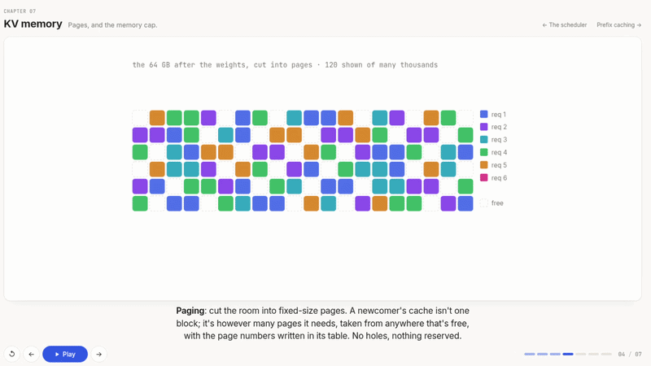

# Learning SGLang

**Inference engines, from the problems up.**



This repository is the source code for the website at **https://wilsonzheng0327.github.io/learning-sglang/**, an illustrated, step-by-step guide to how an LLM inference engine works, using SGLang as the running example. Each chapter is one animated visualization you click through. The captions are the narration; there is almost no other text. Every chapter ends on a question, and the next chapter is the answer, so by the end an engine's scheduler, memory manager, prefix cache, and process layout all read as the obvious response to a chain of "so what do we do about that?"

Numbers throughout are for Llama-3-8B in bf16 on a single H100 unless a chapter says otherwise.

## Chapters

### The loop

Why every piece of the engine exists.

| # | Chapter | Hook | Status |
|---|---|---|---|
| 01 | [Bare-minimum inference](https://wilsonzheng0327.github.io/learning-sglang/ch/01-inference/) | One function, called in a loop. | live |
| 02 | [Attention, per decode step](https://wilsonzheng0327.github.io/learning-sglang/ch/02-attention/) | What a new token needs from the past. | live |
| 03 | [KV cache](https://wilsonzheng0327.github.io/learning-sglang/ch/03-kv-cache/) | Keep k and v. Drop q. | live |
| 04 | [Prefill vs decode](https://wilsonzheng0327.github.io/learning-sglang/ch/04-prefill-decode/) | Two very different workloads. | live |
| 05 | [Batching & continuous batching](https://wilsonzheng0327.github.io/learning-sglang/ch/05-batching/) | Sharing a GPU between users. | live |
| 06 | [The scheduler](https://wilsonzheng0327.github.io/learning-sglang/ch/06-scheduler/) | Two lists, one GPU, one choice per step. | live |
| 07 | [KV memory](https://wilsonzheng0327.github.io/learning-sglang/ch/07-kv-memory/) | Pages, and the memory cap. | live |
| 08 | [Prefix caching](https://wilsonzheng0327.github.io/learning-sglang/ch/08-prefix-caching/) | Same beginning, one copy. | live |
| 09 | [One request, end to end](https://wilsonzheng0327.github.io/learning-sglang/ch/09-one-request/) | From an HTTP POST to the GPU and back. | live |
| 10 | [The scheduler's loop](https://wilsonzheng0327.github.io/learning-sglang/ch/10-engine/) | One Req through one step. | live |

### Making one GPU fast

The loop is correct; now the step is slow for reasons that have nothing to do with the model.

| # | Chapter | Hook | Status |
|---|---|---|---|
| 11 | [CUDA graphs](https://wilsonzheng0327.github.io/learning-sglang/ch/11-cuda-graphs/) | Launching a thousand kernels as one. | live |
| 12 | Piecewise CUDA graphs | When the graph has to break. | planned |
| 13 | torch.compile | Fusing the kernels you were about to launch. | planned |
| 14 | Attention backends | Why there are five kernels for one equation. | planned |
| 15 | Speculative decoding | Guess several tokens, verify in one step. | planned |
| 16 | Quantization | Shrinking the read every step pays for. | planned |
| 17 | Two-batch overlap | Hiding communication behind compute. | planned |

### More than one GPU

The model, the cache, or the traffic no longer fits on one card.

| # | Chapter | Hook | Status |
|---|---|---|---|
| 18 | Tensor parallelism | A model bigger than one GPU. | planned |
| 19 | Pipeline & expert parallelism | Splitting by layer, and by expert. | planned |
| 20 | Data-parallel attention | Replicate the attention side, share the rest. | planned |
| 21 | Hierarchical KV cache | When 64 GB is not enough. | planned |
| 22 | Prefill-decode disaggregation | Two clocks, two machines. | planned |
| 23 | The router | Many engines, one front door. | planned |

### Beyond text · SGLang Omni

Speech and vision break the assumptions of Part I, one at a time.

| # | Chapter | Hook | Status |
|---|---|---|---|
| 24 | Multimodal inputs | A stage in front of the loop. | planned |
| 25 | Multi-stage inference | Thinker, talker, and the pipe between them. | planned |
| 26 | Streaming audio decode | Output with a real-time deadline. | planned |
| 27 | Full duplex | Listening while speaking. | planned |

## Running locally

```sh
npm install
npm run dev     # http://localhost:4321/learning-sglang/
```

Built with Astro, Svelte, and KaTeX. Written and drawn by [Wilson Zheng](https://github.com/WilsonZheng0327).
